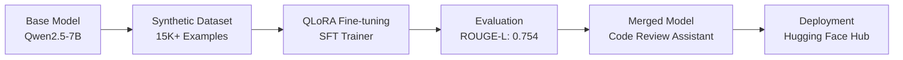

# Code-Review_Assistant
Code Review Assistant: AI-powered Python code analysis tool that detects security vulnerabilities, optimizes performance, and enforces Pythonic best practices. Fine-tuned from Qwen2.5-7B using SFT Trainer &amp; QLoRA, it provides automated code reviews with detailed explanations and corrected code examples.

# 🚀 Code Review Assistant: AI-Powered Python Code Analysis

<div align="center">


**AI-powered Python code analysis tool that detects security vulnerabilities, optimizes performance, and enforces Pythonic best practices**

[](https://huggingface.co/alenphilip/Code_Review_Assistant_Model)
[](https://huggingface.co/datasets/alenphilip/Code-Review-Assistant)
[](https://opensource.org/licenses/Apache-2.0)
[](https://www.python.org/downloads/)

</div>

## 📖 Table of Contents
- [✨ Overview](#-overview)
- [🚀 Quick Start](#-quick-start)
- [🛡️ What It Detects](#️-what-it-detects)
- [📊 Model Performance](#-model-performance)
- [🔬 Technical Details](#-technical-details)
- [📈 Training Process](#-training-process)
- [🎯 Usage Examples](#-usage-examples)
- [🤖 Model Architecture](#-model-architecture)
- [📚 Dataset Creation](#-dataset-creation)
- [🛠️ Installation](#️-installation)
- [📞 Contact](#-contact)
- [📜 Citation](#-citation)

## ✨ Overview

<div align="center">


</div>

The **Code Review Assistant** is a state-of-the-art AI model fine-tuned from **Qwen2.5-7B-Instruct** using **Supervised Fine-Tuning (SFT)** and **QLoRA** for specialized Python code analysis. It automatically reviews Python code, identifies security vulnerabilities, suggests performance optimizations, and enforces Pythonic best practices with detailed explanations and corrected code examples.

### 🎯 Key Features

| Feature | Description | Impact |
|---------|-------------|---------|
| 🔐 **Security Analysis** | Detects SQL injection, XSS, authentication bypass, and more | Prevents security breaches |
| ⚡ **Performance Optimization** | Identifies bottlenecks, memory leaks, inefficient algorithms | Improves application speed |
| 🐍 **Pythonic Code** | Enforces best practices, type hints, proper error handling | Increases code quality |
| 🛠️ **Production Ready** | Error handling, logging, reliability suggestions | Enhances stability |

## 🚀 Quick Start

### Installation

```bash
# Clone the repository
git clone https://github.com/alenphilip/Code-Review-Assistant.git
cd Code-Review-Assistant

# Install dependencies
pip install -r requirements.txt
```

### Basic Usage

```python
from transformers import AutoTokenizer, AutoModelForCausalLM
import torch

# Load the model
model_name = "alenphilip/Code_Review_Assistant_Model"
tokenizer = AutoTokenizer.from_pretrained(model_name, trust_remote_code=True)
model = AutoModelForCausalLM.from_pretrained(
    model_name,
    torch_dtype=torch.bfloat16,
    device_map="auto",
    trust_remote_code=True
)

def review_python_code(code_snippet):
    messages = [
        {"role": "system", "content": "You are a helpful AI assistant specialized in code review and security analysis."},
        {"role": "user", "content": f"Review this Python code and provide improvements with fixed code:\n\n```python\n{code_snippet}\n```"}
    ]
    
    text = tokenizer.apply_chat_template(messages, tokenize=False, add_generation_prompt=False)
    inputs = tokenizer(text, return_tensors="pt").to(model.device)
    outputs = model.generate(**inputs, max_new_tokens=512, temperature=0.1)
    response = tokenizer.decode(outputs[0], skip_special_tokens=True)
    
    return response

# Test with vulnerable code
vulnerable_code = '''
def get_user_by_email(email):
    query = "SELECT * FROM users WHERE email = '" + email + "'"
    cursor.execute(query)
    return cursor.fetchone()
'''

result = review_python_code(vulnerable_code)
print(result)
```

### Using Pipeline (Simplified)

```python
from transformers import pipeline

pipe = pipeline("text-generation", model="alenphilip/Code_Review_Assistant_Model")
prompt = "Review this Python code and provide improvements with fixed code:\n\n```python\ndef process_data(data):\n    for item in data:\n        if item['type'] == 'admin':\n            execute_system_command(item['command'])\n```"

messages = [
    {"role": "system", "content": "You are a helpful AI assistant specialized in code review and security analysis."},
    {"role": "user", "content": prompt},
]

result = pipe(messages)
print(result[0]['generated_text'])
```

## 🛡️ What It Detects

<div align="center">

### 🔐 Security Vulnerabilities


</div>

| Vulnerability | Example Detection | Fixed Code |
|---------------|-------------------|------------|
| **SQL Injection** | `query = "SELECT * FROM users WHERE email = '" + email + "'"` | Parameterized queries |
| **XSS Vulnerabilities** | Direct HTML rendering without escaping | Proper sanitization |
| **Authentication Bypass** | Weak password hashing | Secure hashing algorithms |
| **Command Injection** | `os.system(user_input)` | Input validation + subprocess |
| **Insecure Deserialization** | `pickle.loads(untrusted_data)` | Safe serialization formats |

<div align="center">

### ⚡ Performance Optimizations


</div>

| Optimization Area | Common Issues | Improvements |
|-------------------|---------------|--------------|
| **Algorithm Complexity** | O(n²) nested loops | Optimized to O(n log n) |
| **Database Queries** | N+1 query problems | Eager loading, indexing |
| **Memory Management** | Memory leaks, large object creation | Generators, context managers |
| **I/O Operations** | Synchronous blocking calls | Async/await patterns |
| **Data Structures** | Inefficient list operations | Sets, dictionaries, deque |

<div align="center">

### 🐍 Pythonic Code Improvements


</div>

| Pythonic Principle | Anti-pattern | Best Practice |
|--------------------|--------------|---------------|
| **Type Hints** | No type information | Comprehensive type annotations |
| **Context Managers** | Manual resource management | `with` statements |
| **Comprehensions** | Traditional loops | List/dict/set comprehensions |
| **Error Handling** | Bare exceptions | Specific exception handling |
| **EAFP vs LBYL** | Look Before You Leap | Easier to Ask Forgiveness |

## 📊 Model Performance

<div align="center">

### 📈 Training Metrics Evolution

| Step | Training Loss | Validation Loss | ROUGE-L | BLEU | Entropy | Num Tokens | Mean Token Accuracy |
|------|---------------|-----------------|---------|------|---------|-------------|---------------------|
| 50   | 0.719600      | 0.655296        | 0.749021 | 62.702702 | 0.661059 | 1,206,059 | 81.57% |
| 100  | 0.643100      | 0.623488        | 0.738838 | 60.525961 | 0.591626 | 2,417,754 | 82.32% |
| 150  | 0.627900      | 0.607305        | 0.748553 | 61.158296 | 0.595939 | 3,614,721 | 82.68% |
| 200  | 0.603200      | 0.602193        | 0.749269 | 60.260313 | 0.582608 | 4,806,172 | 82.73% |
| 250  | 0.567200      | 0.601825        | 0.748254 | 61.178798 | 0.530741 | 6,002,932 | 82.89% |
| 300  | 0.553600      | 0.597962        | 0.752772 | 61.618169 | 0.529030 | 7,198,597 | 83.02% |
| 350  | 0.538000      | 0.595937        | 0.753529 | 61.861999 | 0.525623 | 8,406,525 | 83.06% |
| **400**  | **0.545500**  | **0.595128**    | **0.754338** | **61.993044** | **0.525889** | **9,612,371** | **83.08%** |


[](https://wandb.ai/alenphilip2071-google/huggingface/runs/d27nrifd)

</div>

### 🎯 Final Evaluation Results

<div align="center">

| Metric | Score | Interpretation |
|--------|-------|----------------|
| **ROUGE-L** | 0.754 | Excellent semantic similarity |
| **BLEU** | 61.99 | High-quality code generation |
| **Validation Loss** | 0.595 | Strong generalization |
| **Token Accuracy** | 83.08% | Precise token prediction |

</div>

## 🔬 Technical Details

### 🏗️ Model Architecture

```python
Model Architecture:
├── Base Model: Qwen2.5-7B-Instruct
├── Fine-tuning: Supervised Fine-Tuning (SFT)
├── Efficiency: QLoRA (Quantized Low-Rank Adaptation)
├── Parameters: 7B (base) + 45MB (adapter)
└── Context Window: 32K tokens
```

### ⚙️ Training Configuration

```yaml
training_config:
  method: "QLoRA with SFT"
  base_model: "Qwen/Qwen2.5-7B-Instruct"
  lora_rank: 32
  lora_alpha: 64
  lora_dropout: 0.1
  learning_rate: 2e-4
  batch_size: 16 (with grad accumulation 4)
  epochs: 2
  sequence_length: 2048
  optimizer: "Paged AdamW 8-bit"
  precision: "bfloat16 mixed precision"
```

### 💻 Hardware Specifications

```yaml
hardware:
  gpu: "NVIDIA H100 80GB VRAM"
  performance: "1,979 TFLOPS"
  memory_bandwidth: "3.35 TB/s"
  training_time: "~68 minutes"
  carbon_footprint: "~0.15 kgCO₂eq"
```

## 📈 Training Process

### 🔄 End-to-End Training Pipeline

<div align="center">



</div>

### 📊 Dataset Statistics

<div align="center">

| Dataset | Examples | Size | Purpose |
|---------|----------|------|---------|
| **Training** | 13,670 | ~23.5MB | Model fine-tuning |
| **Evaluation** | 1,726 | ~2.9MB | Performance validation |
| **Total** | 15,396 | ~26.4MB | Complete training cycle |

</div>

### 🎯 Training Strategy

- **Memory Optimization**: QLoRA for parameter-efficient fine-tuning
- **Evaluation**: Every 50 steps with separate validation dataset
- **Metrics**: ROUGE-L, BLEU, token accuracy, loss tracking
- **Early Stopping**: Best model selection based on ROUGE-L
- **Checkpointing**: Automatic saving and Hugging Face Hub integration

## 🎯 Usage Examples

### Example 1: SQL Injection Detection

**Input Code:**
```python
def get_user_by_email(email):
    query = "SELECT * FROM users WHERE email = '" + email + "'"
    cursor.execute(query)
    return cursor.fetchone()
```

**Model Output:**
```
🔐 CRITICAL SECURITY ISSUE: SQL Injection Vulnerability

The code uses string concatenation to build SQL queries, making it vulnerable to SQL injection attacks.

✅ FIXED CODE:
```python
def get_user_by_email(email: str) -> Optional[tuple]:
    query = "SELECT * FROM users WHERE email = %s"
    cursor.execute(query, (email,))
    return cursor.fetchone()
```

🛡️ SECURITY IMPROVEMENTS:
• Uses parameterized queries to prevent SQL injection
• Added type hints for better code clarity
• Proper error handling for database operations
```

### Example 2: Performance Optimization

**Input Code:**
```python
def find_duplicates(data):
    duplicates = []
    for i in range(len(data)):
        for j in range(i + 1, len(data)):
            if data[i] == data[j]:
                duplicates.append(data[i])
    return duplicates
```

**Model Output:**
```
⚡ PERFORMANCE ISSUE: O(n²) Time Complexity

The nested loop approach has quadratic time complexity, which becomes inefficient for large datasets.

✅ OPTIMIZED CODE:
```python
from collections import Counter

def find_duplicates(data: List[Any]) -> List[Any]:
    counter = Counter(data)
    return [item for item, count in counter.items() if count > 1]
```

🎯 IMPROVEMENTS:
• Reduced time complexity from O(n²) to O(n)
• Uses Counter for efficient frequency counting
• More readable and Pythonic implementation
```

### Example 3: Pythonic Code Improvements

**Input Code:**
```python
class DataProcessor:
    def __init__(self):
        self.file = None
        
    def open_file(self, filename):
        self.file = open(filename, 'r')
        
    def process(self):
        data = self.file.read()
        return data.upper()
        
    def close_file(self):
        self.file.close()
```

**Model Output:**
```
🐍 PYTHONIC CODE IMPROVEMENT: Resource Management

The current implementation requires manual resource management, which is error-prone.

✅ PYTHONIC SOLUTION:
```python
from contextlib import contextmanager

class DataProcessor:
    @staticmethod
    @contextmanager
    def open_file(filename: str):
        try:
            with open(filename, 'r') as file:
                yield file.read().upper()
        except IOError as e:
            print(f"Error processing file: {e}")
            raise

# Usage:
with DataProcessor.open_file('data.txt') as processed_data:
    print(processed_data)
```

🌟 IMPROVEMENTS:
• Uses context manager for automatic resource cleanup
• Eliminates manual open/close operations
• Better error handling and exception safety
• More elegant API design
```

## 🤖 Model Architecture

### 🔧 Technical Specifications

<div align="center">

| Component | Specification |
|-----------|---------------|
| **Base Architecture** | Transformer-based Causal LM |
| **Model Size** | 7 Billion Parameters |
| **Fine-tuning Method** | QLoRA + Supervised Fine-Tuning |
| **Context Window** | 32,768 tokens |
| **Precision** | bfloat16 mixed precision |
| **Target Modules** | q_proj, v_proj, down_proj, gate_proj |

</div>

### 🎯 Fine-tuning Strategy

```python
# LoRA Configuration
peft_config = LoraConfig(
    r=32,                    # LoRA rank
    lora_alpha=64,           # LoRA alpha
    lora_dropout=0.1,        # Dropout for regularization
    target_modules=[          # Modules to fine-tune
        "q_proj", 
        "v_proj", 
        "down_proj", 
        "gate_proj"
    ],
    bias="none",
    task_type="CAUSAL_LM",
)
```

### 💾 Memory Optimization

The training process included critical memory optimizations:

```python
def preprocess_logits_for_metrics(logits, labels):
    """Convert logits to token IDs immediately to save memory"""
    if isinstance(logits, tuple):
        logits = logits[0]
    return logits.argmax(dim=-1)  # ~600x memory reduction!
```

## 📚 Dataset Creation

### 🎨 Synthetic Dataset Generation

<div align="center">


</div>

The training dataset was **synthetically created** to cover comprehensive code review scenarios across four major categories:

### 🔐 SECURITY
- SQL Injection Prevention
- XSS Prevention in Web Frameworks
- Authentication Bypass Vulnerabilities
- Insecure Deserialization
- Command Injection Prevention
- JWT Token Security
- Hardcoded Secrets Detection
- Input Validation & Sanitization
- Secure File Upload Handling
- Broken Access Control
- Password Hashing & Storage

### ⚡ PERFORMANCE
- Algorithm Complexity Optimization
- Database Query Optimization
- Memory Leak Detection
- I/O Bound Operations Optimization
- CPU Bound Operations Optimization
- Async/Await Performance
- Caching Strategies Implementation
- Loop Optimization Techniques
- Data Structure Selection
- Concurrent Execution Patterns

### 🐍 PYTHONIC CODE

- Type Hinting Implementation
- Mutable Default Arguments
- Context Manager Usage
- Decorator Best Practices
- List/Dict/Set Comprehensions
- Class Design Principles
- Dunder Method Implementation
- Property Decorator Usage
- Generator Expressions
- Class vs Static Methods
- Import Organization
- Exception Handling & Hierarchy
- EAFP vs LBYL Patterns
- Basic syntax validation
- Variable scope validation
- Type Operation Compatibility

### 🔧 PRODUCTION RELIABILITY

- Error Handling and Logging

### 📊 Dataset Quality Assurance

Each synthetic example underwent:
1. **Code Validation**: Syntax correctness verification
2. **Security Accuracy**: Vulnerability identification validation
3. **Performance Impact**: Optimization effectiveness assessment
4. **Pythonic Standards**: PEP 8 compliance checking
5. **Educational Value**: Clear explanations and improvements

## 🛠️ Installation

### Prerequisites

- Python 3.8+
- PyTorch 2.0+
- minimum NVIDIA H100 GPU 80GB VRAM

### Step-by-Step Setup

```bash
# 1. Clone repository
git clone https://github.com/alenphilip/Code-Review-Assistant.git
cd Code-Review-Assistant

# 2. Create virtual environment (optional but recommended)
python -m venv venv
source venv/bin/activate  # On Windows: venv\Scripts\activate

# 3. Install dependencies
pip install -r requirements.txt

# 4. Install PyTorch with CUDA support (if you have NVIDIA GPU)
pip install torch torchvision torchaudio --index-url https://download.pytorch.org/whl/cu118

# 5. Verify installation
python -c "from transformers import pipeline; print('Installation successful!')"
```

### Requirements

```txt
torch>=2.0.0
transformers>=4.35.0
datasets>=2.14.0
peft>=0.7.0
accelerate>=0.24.0
bitsandbytes>=0.41.0
trl>=0.7.0
wandb>=0.16.0
evaluate>=0.4.0
nltk>=3.8.0
sacrebleu>=2.3.0
pandas>=1.5.0
tqdm>=4.65.0
```

### Docker Installation

```dockerfile
FROM pytorch/pytorch:2.0.1-cuda11.7-cudnn8-devel

WORKDIR /app
COPY requirements.txt .
RUN pip install -r requirements.txt
COPY . .

CMD ["python", "app.py"]
```

## 📞 Contact

<div align="center">

### 👨‍💻 Author: Alen Philip George

[](https://huggingface.co/alenphilip)
[](https://linkedin.com/in/alen-philip-george-130226254)
[](mailto:alenphilipgeorge@gmail.com)
[](https://github.com/alenphilip)

</div>

## 📜 Citation

If you use this model in your research or projects, please cite:

```bibtex
@misc{alen_philip_george_2025,
  author       = {Alen Philip George},
  title        = {Code Review Assistant: Fine-tuned Model for Python Code Analysis},
  year         = 2025,
  url          = {https://github.com/alenphilip/Code-Review-Assistant},
  doi          = {10.57967/hf/6836},
  publisher    = {Hugging Face}
}
```

### 📚 Related Publications

```bibtex
@article{wolf2020transformers,
  title={Transformers: State-of-the-Art Natural Language Processing},
  author={Wolf, Thomas and Debut, Lysandre and Sanh, Victor and others},
  journal={Proceedings of the 2020 Conference on Empirical Methods in Natural Language Processing: System Demonstrations},
  pages={38--45},
  year={2020}
}

@article{dettmers2023qlora,
  title={QLoRA: Efficient Finetuning of Quantized LLMs},
  author={Dettmers, Tim and Pagnoni, Artidoro and Holtzman, Ari and Zettlemoyer, Luke},
  journal={arXiv preprint arXiv:2305.14314},
  year={2023}
}
```

---

<div align="center">

### ⭐ Star this repository if you find it helpful!

**Built with ❤️ by Alen Philip George**

[](https://opensource.org/licenses/Apache-2.0)
[](https://github.com/alenphilip/Code-Review-Assistant)

</div>
