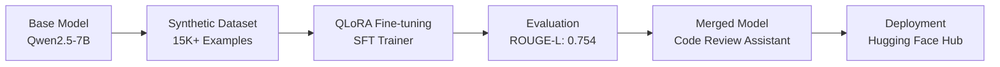

# 🚀 Code Review Assistant: AI-Powered Python Code Analysis

<div align="center">


**AI-powered Python code analysis tool that detects security vulnerabilities, optimizes performance, and enforces Pythonic best practices**

[](https://huggingface.co/alenphilip/Code_Review_Assistant_Model)
[](https://huggingface.co/datasets/alenphilip/Code-Review-Assistant)
[](https://huggingface.co/datasets/alenphilip/Code-Review-Assistant-Eval)
[](https://opensource.org/licenses/Apache-2.0)
[](https://www.python.org/downloads/)

</div>

## 📖 Table of Contents
- [✨ Overview](#-overview)
- [🚀 Quick Start](#-quick-start)
- [🛡️ What It Detects](#️-what-it-detects)
- [📊 Model Performance](#-model-performance)
- [🔬 Technical Details](#-technical-details)
- [📈 Training Process](#-training-process)
- [🎯 Usage Examples](#-usage-examples)
- [🤖 Model Architecture](#-model-architecture)
- [📚 Dataset Creation](#-dataset-creation)
- [🛠️ Installation](#️-installation)
- [📞 Contact](#-contact)
- [📜 Citation](#-citation)

## ✨ Overview

<div align="center">

<h2>🔍 AI Code Review Assistant</h2>
<h3>Automated Security Analysis • Performance Optimization • Pythonic Best Practices • </h3>


</div>

The **Code Review Assistant** is a state-of-the-art AI model fine-tuned from **Qwen2.5-7B-Instruct** using **Supervised Fine-Tuning (SFT)** and **QLoRA** for specialized Python code analysis. It automatically reviews Python code, identifies security vulnerabilities, suggests performance optimizations, and enforces Pythonic best practices with detailed explanations and corrected code examples. 

An AI Model That Reviews AND Fixes Your Python Code  
**→ Takes buggy/vulnerable Python code as input.**  
**→ provides security analysis, performance optimization and Pythonic improvements**  
**→ OUTPUTS REVIEW + CORRECTED, PRODUCTION-READY CODE.**  

### 🎯 Key Features

| Feature | Description | Impact |
|---------|-------------|---------|
| 🔐 **Security Analysis** | Detects SQL injection, XSS, authentication bypass, and more | Prevents security breaches |
| ⚡ **Performance Optimization** | Identifies bottlenecks, memory leaks, inefficient algorithms | Improves application speed |
| 🐍 **Pythonic Code** | Enforces best practices, type hints, proper error handling | Increases code quality |
| 🛠️ **Production Ready** | Error handling, logging, reliability suggestions | Enhances stability |

## 🚀 Quick Start

### Installation

```bash
# Clone the repository
git clone https://github.com/alenphilip/Code-Review-Assistant.git
cd Code-Review-Assistant

# Install dependencies
pip install -r requirements.txt
```

### Basic Usage

```python
from transformers import AutoTokenizer, AutoModelForCausalLM
import torch

# Load the model
model_name = "alenphilip/Code_Review_Assistant_Model"
tokenizer = AutoTokenizer.from_pretrained(model_name, trust_remote_code=True)
model = AutoModelForCausalLM.from_pretrained(
    model_name,
    torch_dtype=torch.bfloat16,
    device_map="auto",
    trust_remote_code=True
)

def review_python_code(code_snippet):
    messages = [
        {"role": "system", "content": "You are a helpful AI assistant specialized in code review and security analysis."},
        {"role": "user", "content": f"Review this Python code and provide improvements with fixed code:\n\n```python\n{code_snippet}\n```"}
    ]
    
    text = tokenizer.apply_chat_template(messages, tokenize=False, add_generation_prompt=False)
    inputs = tokenizer(text, return_tensors="pt").to(model.device)
    outputs = model.generate(**inputs, max_new_tokens=512, temperature=0.1)
    response = tokenizer.decode(outputs[0], skip_special_tokens=True)
    
    return response

# Test with vulnerable code
vulnerable_code = '''
def get_user_by_email(email):
    query = "SELECT * FROM users WHERE email = '" + email + "'"
    cursor.execute(query)
    return cursor.fetchone()
'''

result = review_python_code(vulnerable_code)
print(result)
```

### Using Pipeline (Simplified)

```python
from transformers import pipeline

pipe = pipeline("text-generation", model="alenphilip/Code_Review_Assistant_Model")
prompt = "Review this Python code and provide improvements with fixed code:\n\n```python\ndef process_data(data):\n    for item in data:\n        if item['type'] == 'admin':\n            execute_system_command(item['command'])\n```"

messages = [
    {"role": "system", "content": "You are a helpful AI assistant specialized in code review and security analysis."},
    {"role": "user", "content": prompt},
]

result = pipe(messages)
print(result[0]['generated_text'])
for message in conversation:
    print(f"\n{message['role'].upper()}:")
    print("-" * 50)
    print(message['content'])
    print()
```

##  What It Detects

<div align="center">

### 🛡️ Security Vulnerabilities

</div>

| Vulnerability | Example Detection | Fixed Code |
|---------------|-------------------|------------|
| **SQL Injection** | `query = "SELECT * FROM users WHERE email = '" + email + "'"` | Parameterized queries |
| **XSS Prevention** | `return f"<div>{user_input}</div>"` | HTML escaping, template sanitization |
| **Authentication Bypass** | `if password == "admin123":` | Secure hashing (bcrypt, argon2) |
| **Insecure Deserialization** | `pickle.loads(untrusted_data)` | JSON, safe serialization formats |
| **Command Injection** | `os.system(user_input)` | Input validation, subprocess with args |
| **JWT Token Security** | No expiration, weak secret | Proper validation, strong secrets |
| **Hardcoded Secrets** | `API_KEY = "secret123"` | Environment variables, secret management |
| **Input Validation** | No input checks | Schema validation, sanitization |
| **File Upload Security** | Direct file save | File type validation, secure storage |
| **Broken Access Control** | No permission checks | Role-based access control |
| **Password Storage** | Plain text passwords | Secure hashing with salt |


<div align="center">

### ⚡ Performance Optimizations

</div>

| Optimization Area | Common Issues | Improvements |
|-------------------|---------------|--------------|
| **Algorithm Complexity** | O(n²) nested loops | Optimized to O(n log n) |
| **Database Queries** | N+1 query problems | Eager loading, indexing, query optimization |
| **Memory Leak Detection** | Unclosed resources, circular references | Context managers, weak references |
| **I/O Operations** | Synchronous blocking calls | Async/await, batch processing |
| **CPU Operations** | Inefficient computations | Vectorization, parallel processing |
| **Async/Await Patterns** | Blocking I/O in async functions | Proper async library usage |
| **Caching Strategies** | Repeated expensive computations | Memoization, Redis caching |
| **Loop Optimization** | Inefficient iterations | List comprehensions, generator expressions |
| **Data Structure Selection** | Wrong data structures | Appropriate collections (deque, set, dict) |
| **Concurrent Execution** | Race conditions, deadlocks | Thread pools, async tasks |

<div align="center">

### 🐍 Pythonic Code Improvements

</div>

| Pythonic Principle | Anti-pattern | Best Practice |
|--------------------|--------------|---------------|
| **Type Hinting** | No type information | Comprehensive type annotations |
| **Mutable Defaults** | `def func(items=[]):` | `def func(items=None):` |
| **Context Managers** | Manual resource management | `with` statements, custom context managers |
| **Decorator Usage** | Complex function wrapping | Clean decorators with `functools.wraps` |
| **Comprehensions** | Traditional loops | List/dict/set comprehensions |
| **Class Design** | Poor inheritance hierarchy | Composition over inheritance, ABCs |
| **Dunder Methods** | Missing special methods | Proper `__str__`, `__repr__`, `__eq__` |
| **Property Decorators** | Direct attribute access | Computed properties with `@property` |
| **Generator Expressions** | Building large lists | Lazy evaluation with generators |
| **Static vs Class Methods** | Misused method types | Proper `@staticmethod` and `@classmethod` |
| **Import Organization** | Wildcard imports | Explicit imports, proper module structure |
| **Exception Handling** | Bare except clauses | Specific exceptions, proper hierarchy |
| **EAFP vs LBYL** | Look Before You Leap | Easier to Ask Forgiveness than Permission |
| **Syntax Validation** | Basic syntax errors | Code quality tools, linters |
| **Variable Scope** | Global variable abuse | Proper scoping, function parameters |
| **Type Compatibility** | Incorrect type operations | Type checking, proper conversions |

<div align="center">

### 🔧 Production Reliability

</div>

| Reliability Aspect | Common Issues | Best Practices |
|-------------------|---------------|----------------|
| **Error Handling & Logging** | Silent failures, no logging | Structured logging, proper exception handling |
## 📊 Model Performance

<div align="center">

### 📈 Training Metrics Evolution

| Step | Training Loss | Validation Loss | ROUGE-L | BLEU | Entropy | Num Tokens | Mean Token Accuracy |
|------|---------------|-----------------|---------|------|---------|-------------|---------------------|
| 50   | 0.719600      | 0.655296        | 0.749021 | 62.702702 | 0.661059 | 1,206,059 | 81.57% |
| 100  | 0.643100      | 0.623488        | 0.738838 | 60.525961 | 0.591626 | 2,417,754 | 82.32% |
| 150  | 0.627900      | 0.607305        | 0.748553 | 61.158296 | 0.595939 | 3,614,721 | 82.68% |
| 200  | 0.603200      | 0.602193        | 0.749269 | 60.260313 | 0.582608 | 4,806,172 | 82.73% |
| 250  | 0.567200      | 0.601825        | 0.748254 | 61.178798 | 0.530741 | 6,002,932 | 82.89% |
| 300  | 0.553600      | 0.597962        | 0.752772 | 61.618169 | 0.529030 | 7,198,597 | 83.02% |
| 350  | 0.538000      | 0.595937        | 0.753529 | 61.861999 | 0.525623 | 8,406,525 | 83.06% |
| **400**  | **0.545500**  | **0.595128**    | **0.754338** | **61.993044** | **0.525889** | **9,612,371** | **83.08%** |

<div align="center">
	
### 📈 Training Progress


[](https://wandb.ai/alenphilip2071-google/huggingface/runs/d27nrifd)
</div>
</div>

### 🎯 Final Evaluation Results

<div align="center">

| Metric | Score | Interpretation |
|--------|-------|----------------|
| **ROUGE-L** | 0.754 | Excellent semantic similarity |
| **BLEU** | 61.99 | High-quality code generation |
| **Validation Loss** | 0.595 | Strong generalization |
| **Token Accuracy** | 83.08% | Precise token prediction |

</div>

## 🔬 Technical Details

### 🏗️ Model Architecture

```python
Model Architecture:
├── Base Model: Qwen2.5-7B-Instruct
├── Fine-tuning: Supervised Fine-Tuning (SFT)
├── Efficiency: QLoRA (Quantized Low-Rank Adaptation)
├── Parameters: 7B (base) + 45MB (adapter)
└── Context Window: 32K tokens
```

### ⚙️ Training Configuration

```yaml
training_config:
  method: "QLoRA with SFT"
  base_model: "Qwen/Qwen2.5-7B-Instruct"
  lora_rank: 32
  lora_alpha: 64
  lora_dropout: 0.1
  learning_rate: 2e-4
  batch_size: 16 (with grad accumulation 4)
  epochs: 2
  sequence_length: 2048
  optimizer: "Paged AdamW 8-bit"
  precision: "bfloat16 mixed precision"
```

### 💻 Hardware Specifications

```yaml
hardware:
  gpu: "NVIDIA H100 80GB VRAM"
  performance: "1,979 TFLOPS"
  memory_bandwidth: "3.35 TB/s"
  training_time: "~68 minutes"
  carbon_footprint: "~0.15 kgCO₂eq"
```

## 📈 Training Process

### 🔄 End-to-End Training Pipeline

<div align="center">



</div>

### 📊 Dataset Statistics

<div align="center">

| Dataset | Examples | Size | Purpose |
|---------|----------|------|---------|
| **Training** | 13,670 | ~23.5MB | Model fine-tuning |
| **Evaluation** | 1,726 | ~2.9MB | Performance validation |
| **Total** | 15,396 | ~26.4MB | Complete training cycle |

</div>

### 🎯 Training Strategy

- **Memory Optimization**: QLoRA for parameter-efficient fine-tuning
- **Evaluation**: Every 50 steps with separate validation dataset
- **Metrics**: ROUGE-L, BLEU, token accuracy, loss tracking
- **Early Stopping**: Best model selection based on ROUGE-L
- **Checkpointing**: Automatic saving and Hugging Face Hub integration

## 🎯 Usage Examples

### Example 1: 🔐 Security Vulnerability Detection

**Input Code:**
```python
# In a Celery task file
from celery import Celery
import psycopg2

app = Celery('tasks', broker='redis://localhost')

@app.task
def record_event(user_id, event_type):
    conn = psycopg2.connect(dsn="...")
    cursor = conn.cursor()
    sql = f"INSERT INTO events (user_id, event_type) VALUES ({user_id}, '{event_type}')"
    cursor.execute(sql)
    conn.commit()
    conn.close()
```
**Model Output:**  
Critical Security Issue: SQL Injection in Celery Task  

The Celery task for recording events uses f-string formatting to insert user-provided data directly into a PostgreSQL query. This is a critical SQL injection vulnerability. An attacker could provide a malicious `event_type` like `'; DROP TABLE events; --` to destroy the database table. All input data from external sources must be parameterized.

**Fixed Code:**
```python
# In a Celery task file
from celery import Celery
import psycopg2
from psycopg2 import extensions

app = Celery('tasks', broker='redis://localhost')

@app.task(bind=True, name='record_event')
def record_event(self, user_id: int, event_type: str):
    if not isinstance(user_id, int) or user_id < 1:
        raise ValueError("Invalid user ID")
    
    # Sanitize the event type to prevent SQL injection.
    # For a production system, a whitelist of allowed types would be ideal.
    if not event_type.isalnum():
        raise ValueError("Invalid event type format")

    conn = None
    try:
        conn = psycopg2.connect(dsn="...")
        with conn.cursor() as cursor:
            sql = "INSERT INTO events (user_id, event_type) VALUES (%s, %s)"
            cursor.execute(sql, (user_id, event_type))
        
        conn.commit()
        self.logger.info(f"Event recorded: user_id={user_id}, event_type='{event_type}'")
    except psycopg2.Error as e:
        self.logger.error(f"Failed to record event: {e}")
        conn.rollback()
        raise
    finally:
        if conn:
            conn.close()
```
**🛡️ SECURITY IMPROVEMENTS:**  
• Uses parameterized queries to prevent SQL injection  
• Added type hints for better code clarity  
• Proper error handling for database operations  
• Context manager for database connection  
• Comprehensive type hints  
### Example 2: Performance Optimization

**Input Code:**
```python
def merge_intervals(intervals):
    if not intervals:
        return []
    intervals.sort(key=lambda x: x[0])
    merged = [intervals[0]]
    for i in range(1, len(intervals)):
        last_merged = merged[-1]
        current = intervals[i]
        # Check against all previously merged intervals
        was_merged = False
        for j in range(len(merged)):
            if max(merged[j][0], current[0]) <= min(merged[j][1], current[1]):
                merged[j] = [min(merged[j][0], current[0]), max(merged[j][1], current[1])]
                was_merged = True
                break
        if not was_merged:
            merged.append(current)
    return merged
```

**Model Output:**  
Algorithm Complexity Optimization: Inefficient Nested Loop  

The code correctly merges overlapping intervals but uses a nested loop structure that results in an O(n^2) time complexity. For each interval, it iterates through all previous merged intervals to check for overlap. This is inefficient.

A more optimal approach is to sort the intervals by their start times and then iterate through them once. For each interval, you either merge it with the current 'active' interval or add it as a new active interval. This ensures that each interval is only processed once, resulting in an O(n log n) time complexity overall.

Fixed Code:
```python
from typing import List, Tuple

def merge_intervals(intervals: List[Tuple[int, int]]) -> List[Tuple[int, int]]:
    if not intervals:
        return []

    # Sort intervals by their start times
    intervals.sort(key=lambda x: x[0])

    merged = []
    for interval in intervals:
        if not merged or merged[-1][1] < interval[0]:
            merged.append(interval)
        else:
            # Merge with the last interval
            merged[-1] = (merged[-1][0], max(merged[-1][1], interval[1]))

    return merged
```
**🎯PERFOMANCE IMPROVEMENTS:**  
• Reduced time complexity from O(n²) to O(nlogn)  
• Single pass algorithm instead of nested loops  
• More readable and maintainable code  
• Comprehensive type annotations  
• Better variable naming  

### Example 3: Pythonic Code Improvements

**Input Code:**
```python
def inject_db_session(func):
    def wrapper(*args, **kwargs):
        session = get_db_session()
        try:
            return func(session, *args, **kwargs)
        finally:
            session.close()
    return wrapper

@inject_db_session
def get_user(user_id, session):
    return session.query(User).get(user_id)

# This call fails
get_user(user_id=123)
```

**Model Output:**  
Decorator Best Practice: Inflexible Signature Injection  

The decorator modifies the function signature by injecting `session` as an argument. This makes the decorated function inflexible; it can only be called with the new `session` argument. The caller has no control over whether to use a specific session or if one is even needed. A better approach is to use a context manager for the database session and let the context manager handle the lifecycle.

Fixed Code:
```python
from contextlib import contextmanager

@contextmanager
def db_session():
    session = get_db_session()
    try:
        yield session
    finally:
        session.close()

def get_user(user_id: int):
    # The function now accepts a session or None
    with db_session() as session:
        if session is None:
            raise RuntimeError('Session was not provided')
        return session.query(User).get(user_id)

# Callers can choose to use their own session
with get_db_session() as my_session:
    user = get_user(123, session=my_session)

# Or let the decorator manage it
user_from_decorator = get_user(456)
```
**🌟 PYTHONIC IMPROVEMENTS:**  
• Uses context manager for automatic resource cleanup  
• More flexible function signature  
• Better separation of concerns  
• Caller has control over session management  
• Cleaner API design  
• Proper error handling  

### Example 4: Production Reliability

**Input Code:**
```python
class MyContext:
    def __enter__(self):
        return self
    def __exit__(self, exc_type, exc_val, exc_tb):
        try:
            # cleanup can also fail
            raise TypeError("Cleanup failed")
        except TypeError:
            print("Caught cleanup error")

with MyContext():
    raise ValueError("Original error")
```

**Model Output:**  
Issue: Exception Masking in `__exit__`  

An exception raised within the `__exit__` method of a context manager is caught by the `except` block inside `__exit__`. However, if this `except` block itself raises another exception (as it does here), that new exception will be propagated out of the `with` statement, completely masking the original `ValueError`. This makes debugging extremely difficult.

Fixed Code:
```python
import logging

class MyContext:
    def __enter__(self):
        logging.info("Entering context.")
        return self
    
    def __exit__(self, exc_type, exc_val, exc_tb):
        logging.info("Exiting context.")
        try:
            raise TypeError("Cleanup failed")
        except TypeError as e:
            logging.error("A cleanup failure occurred.", exc_info=True)
            # Do not re-raise; let the original exception propagate.
            return False

try:
    with MyContext():
        raise ValueError("Original error")
except ValueError as e:
    logging.critical(f"Successfully caught the original error: {e}")
```
**🛠️ Reliability Improvements:**  
• Prevents exception masking in context managers  
• Proper logging for debugging and monitoring  
• Clear separation of cleanup errors from business logic errors  
• Maintains original exception context  
• Better error handling patterns  

## 🤖 Model Architecture

### 🔧 Technical Specifications

<div align="center">

| Component | Specification |
|-----------|---------------|
| **Base Architecture** | Transformer-based Causal LM |
| **Model Size** | 7 Billion Parameters |
| **Fine-tuning Method** | QLoRA + Supervised Fine-Tuning |
| **Context Window** | 32,768 tokens |
| **Precision** | bfloat16 mixed precision |
| **Target Modules** | q_proj, v_proj, down_proj, gate_proj |

</div>

### 🎯 Fine-tuning Strategy

```python
# LoRA Configuration
peft_config = LoraConfig(
    r=32,                    # LoRA rank
    lora_alpha=64,           # LoRA alpha
    lora_dropout=0.1,        # Dropout for regularization
    target_modules=[          # Modules to fine-tune
        "q_proj", 
        "v_proj", 
        "down_proj", 
        "gate_proj"
    ],
    bias="none",
    task_type="CAUSAL_LM",
)
```

### 💾 Memory Optimization

The training process included critical memory optimizations:

```python
def preprocess_logits_for_metrics(logits, labels):
    """Convert logits to token IDs immediately to save memory"""
    if isinstance(logits, tuple):
        logits = logits[0]
    return logits.argmax(dim=-1)  # ~600x memory reduction!
```

## 📚 Dataset Creation

### 🎨 Synthetic Dataset Generation

<div align="center">

<h3>📚 Synthetic Dataset Creation</h3>
<h4>15K+ Carefully Crafted Python Examples</h4>

[](https://huggingface.co/datasets/alenphilip/Code-Review-Assistant)
[](https://huggingface.co/datasets/alenphilip/Code-Review-Assistant-Eval)
[](https://huggingface.co/datasets/alenphilip/Code-Review-Assistant)
[](https://opensource.org/licenses/Apache-2.0)

</div>

### 📊 Dataset Statistics & Access

<div align="center">

| Dataset | 🤗 Hugging Face Link | Examples | Size | Download |
|---------|---------------------|----------|------|----------|
| **Training** | [`alenphilip/Code-Review-Assistant`](https://huggingface.co/datasets/alenphilip/Code-Review-Assistant) | 13,670 | ~23.5MB | [](https://huggingface.co/datasets/alenphilip/Code-Review-Assistant) |
| **Evaluation** | [`alenphilip/Code-Review-Assistant-Eval`](https://huggingface.co/datasets/alenphilip/Code-Review-Assistant-Eval) | 1,726 | ~2.9MB | [](https://huggingface.co/datasets/alenphilip/Code-Review-Assistant-Eval) |
| **Total** | **Both Datasets** | **15,396** | **~26.4MB** | [](https://huggingface.co/alenphilip) |

</div>

The datasets were **synthetically created** to cover comprehensive code review scenarios across four major categories:

### 🔐 SECURITY
- SQL Injection Prevention
- XSS Prevention in Web Frameworks
- Authentication Bypass Vulnerabilities
- Insecure Deserialization
- Command Injection Prevention
- JWT Token Security
- Hardcoded Secrets Detection
- Input Validation & Sanitization
- Secure File Upload Handling
- Broken Access Control
- Password Hashing & Storage

### ⚡ PERFORMANCE
- Algorithm Complexity Optimization
- Database Query Optimization
- Memory Leak Detection
- I/O Bound Operations Optimization
- CPU Bound Operations Optimization
- Async/Await Performance
- Caching Strategies Implementation
- Loop Optimization Techniques
- Data Structure Selection
- Concurrent Execution Patterns

### 🐍 PYTHONIC CODE

- Type Hinting Implementation
- Mutable Default Arguments
- Context Manager Usage
- Decorator Best Practices
- List/Dict/Set Comprehensions
- Class Design Principles
- Dunder Method Implementation
- Property Decorator Usage
- Generator Expressions
- Class vs Static Methods
- Import Organization
- Exception Handling & Hierarchy
- EAFP vs LBYL Patterns
- Basic syntax validation
- Variable scope validation
- Type Operation Compatibility

### 🔧 PRODUCTION RELIABILITY

- Error Handling and Logging

### 📊 Dataset Quality Assurance

Each synthetic example underwent:
1. **Code Validation**: Syntax correctness verification
2. **Security Accuracy**: Vulnerability identification validation
3. **Performance Impact**: Optimization effectiveness assessment
4. **Pythonic Standards**: PEP 8 compliance checking
5. **Educational Value**: Clear explanations and improvements

## 🛠️ Installation

### Prerequisites

- Python 3.8+
- PyTorch 2.0+
- minimum NVIDIA H100 GPU 80GB VRAM

### Step-by-Step Setup

```bash
# 1. Clone repository
git clone https://github.com/alenphilip/Code-Review-Assistant.git
cd Code-Review-Assistant

# 2. Create virtual environment (optional but recommended)
python -m venv venv
source venv/bin/activate  # On Windows: venv\Scripts\activate

# 3. Install dependencies
pip install -r requirements.txt

# 4. Install PyTorch with CUDA support (if you have NVIDIA GPU)
pip install torch torchvision torchaudio --index-url https://download.pytorch.org/whl/cu118

# 5. Verify installation
python -c "from transformers import pipeline; print('Installation successful!')"
```

### Requirements

```txt
torch>=2.0.0
transformers>=4.35.0
datasets>=2.14.0
peft>=0.7.0
accelerate>=0.24.0
bitsandbytes>=0.41.0
trl>=0.7.0
wandb>=0.16.0
evaluate>=0.4.0
nltk>=3.8.0
sacrebleu>=2.3.0
pandas>=1.5.0
tqdm>=4.65.0
```

### Docker Installation

```dockerfile
FROM pytorch/pytorch:2.0.1-cuda11.7-cudnn8-devel

WORKDIR /app
COPY requirements.txt .
RUN pip install -r requirements.txt
COPY . .

CMD ["python", "app.py"]
```

## 📞 Contact

<div align="center">

### 👨‍💻 Author: Alen Philip George

[](https://huggingface.co/alenphilip)
[](https://www.linkedin.com/in/alenphilipgeorge)
[](mailto:alenphilipgeorge@gmail.com)
[](https://github.com/alenphilip)

</div>

## 📜 Citation

If you use this model in your research or projects, please cite:

```bibtex
@misc{alen_philip_george_2025,
  author       = {Alen Philip George},
  title        = {Code Review Assistant: Fine-tuned Model for Python Code Analysis},
  year         = 2025,
  url          = {https://github.com/alenphilip/Code-Review-Assistant},
  doi          = {10.57967/hf/6836},
  publisher    = {Hugging Face}
}
```

If you use the train dataset in your research or projects, please cite:
```bibtex
@misc{alen_philip_george_2025,
	author       = { Alen Philip George },
	title        = { Code-Review-Assistant (Revision 57aa4e9) },
	year         = 2025,
	url          = { https://huggingface.co/datasets/alenphilip/Code-Review-Assistant },
	doi          = { 10.57967/hf/6834 },
	publisher    = { Hugging Face }
}
```
If you use the evaluation dataset in your research or projects, please cite:
```bibtex
@misc{alen_philip_george_2025,
    author       = { Alen Philip George },  
    title        = { Code-Review-Assistant-Eval (Revision 30002ea) },  
    year         = 2025,  
    url          = { https://huggingface.co/datasets/alenphilip/Code-Review-Assistant-Eval },  
    doi          = { 10.57967/hf/6837 },  
    publisher    = { Hugging Face }  
}
```

### 📚 Related Publications

```bibtex
@article{wolf2020transformers,
  title={Transformers: State-of-the-Art Natural Language Processing},
  author={Wolf, Thomas and Debut, Lysandre and Sanh, Victor and others},
  journal={Proceedings of the 2020 Conference on Empirical Methods in Natural Language Processing: System Demonstrations},
  pages={38--45},
  year={2020}
}

@article{dettmers2023qlora,
  title={QLoRA: Efficient Finetuning of Quantized LLMs},
  author={Dettmers, Tim and Pagnoni, Artidoro and Holtzman, Ari and Zettlemoyer, Luke},
  journal={arXiv preprint arXiv:2305.14314},
  year={2023}
}
```

---

<div align="center">

### ⭐ Star this repository if you find it helpful!

**Built with ❤️ by Alen Philip George**

[](https://opensource.org/licenses/Apache-2.0)
[](https://github.com/alenphilip/Code-Review-Assistant)

</div>
